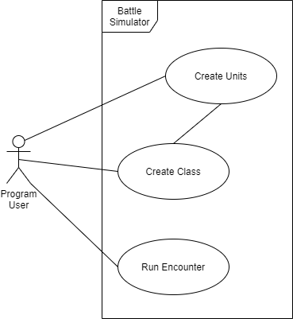

# Final-Project-Proposal
Proposal Docs for a SRD5 Battle Simulator project, Final Project for CIS3296, Fall 2020

Cameron Gallagher | 14 Sept 2020 | Professor Dominic Letarte

### Project Description

In this project, I intend to implement a reduced ruleset presented in the [SRD5](https://media.wizards.com/2016/downloads/DND/SRD-OGL_V5.1.pdf), as presented by Wizard's of the Coast, making use of their Open Game License and Fan Content Policy.  The project will be coded entirely in Java, utilizing the flexibility of class and interface implementations, and inheritence and polymorphism. The project will utilize a GUI to represent a gridded battle map, with elements including PCs, monsters, areas of effect, and terrain modifiers.

### UML Diagram

### Educational Goals

This project will mainly draw upon the educational goals of Object Oriented Design and Graphical User Interfaces.  To a lesser extent, the project will be utilizing On-the-fly Coding and Design Patterns. The practical usage of these goals are detailed:

- Object Oriented Design
  - This program will use object oriented design massively.  Almost every piece of functionality will be derived from an object (PCs and monsters, maps, AI).  This is important specifically to this program, and in a broader sense as well because almost all of the invidual units will have many functions in common (creation, modification, deployment, initiative), and using the principles of OOD, the amount of coding will be minimized.
  
- Graphical User Interface
  - This program will utilize a GUI to depict the simulated battle to the user.  This principle is important in that it allows the programs user to understand what the program is doing, on a surface level, without having to dig into the code or console.  They can simply execute a file, and watch the program work.  This user display will hopefully employ the ideas of UX and UI design to a high standard.
  
- On-the-fly coding
  - So much of this project will be able to be modified on the fly.  On execution, the user will be able to completely revamp the built in units, maps, and if time permits, AI, using both object declaration and file I/O.  Everything will be built with composition in mind, so changing things in real time will be a single execution of a short function.  This is important because it adds so much versatility to the code, and prevents the need to actually modify hard coded lines to change program functionality.
  
- Design Patterns
  - The idea that there are industry best practices will really help to make this program easier to code.  The idea of creational patterns specifically will help to streamline unit creation.  Structural patterns will help to make the multi-tiered inheritance this project relies so heavily on as easy as possible, and as logical to follow as possible.  Behavioral patterns will be important to ensure that the objects will be able to interact with one another in as few lines of code as possible, and in a way that is intuitive.  Proper employment of this goal is integral to making this project successful, and it is important because it will prepare us to write code that is up to industry standard.
  
### More Detail

Within the GUI console, the user will be able to configure different units (PCs and monsters), implementing all of their stats, abiliites, and graphical representation.  After the creation a unit, its stats will be saved to an external file, or database, dependent on project group's preference.  The program will then be able to call back the files in subsequent executions, allowing the user to modify the unit and present it to the GUI.  PCs will make use of the various classes, races, and subclasses presented in the SRD5, and will be able to level up as the user needs.

As part of the initial implementation, there will be a number of built in PCs and monsters.  Each PC and monster will be able to make use of one of the hard coded AIs for behavior, which details the usage of actions, bonus actions and reactions on their turn.  The program will then automatically execute a full battle, determining the winner based on the preset conditions.
  
#### Necessary Skills

- Understanding of Java
- General idea of JSON format
- Strong understanding of GUI
- Experience with DnD 5e ruleset**
- (Optional) Understanding of database integration in Java

** Though this is not necessary, it takes away a lot of the background reading this project entails
  
#### Relevant Documents/Legal

This project is in compliance with the SRD5 Open Game License.  More detailed explanation of Wizard's of the Coast's legal requirements can be found through the following links:

- [DnD SRD5](https://media.wizards.com/2016/downloads/DND/SRD-OGL_V5.1.pdf)
- [Fan Content Policy](https://company.wizards.com/fancontentpolicy)
